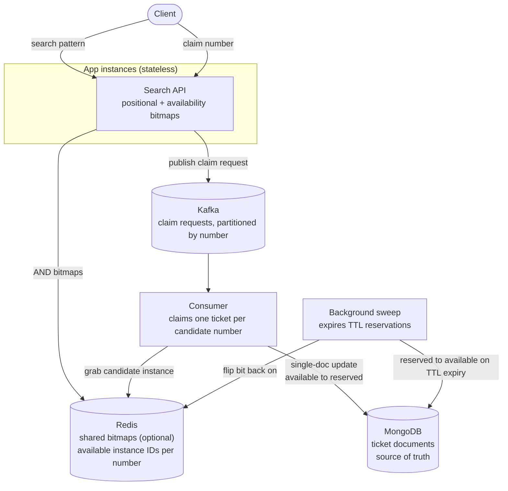
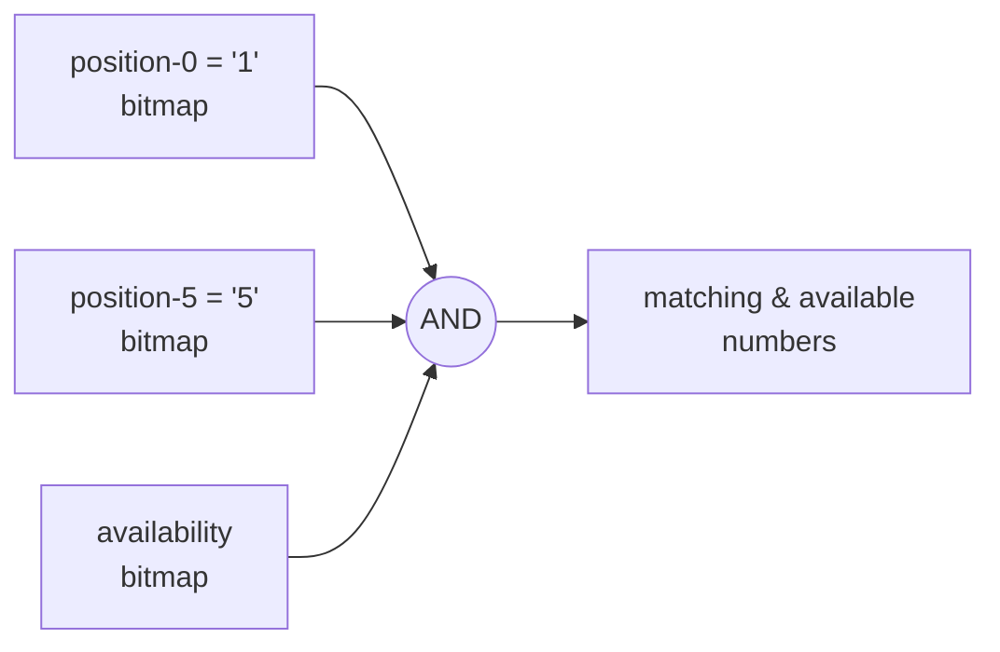
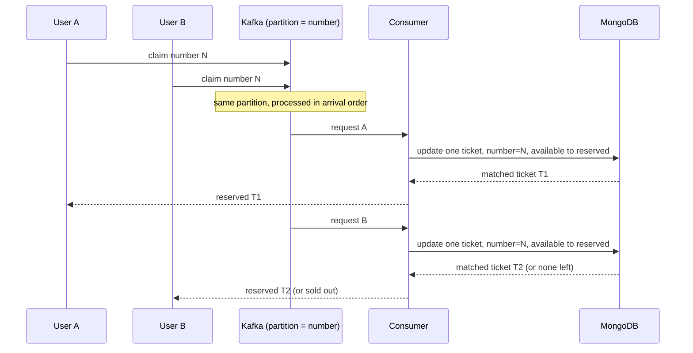
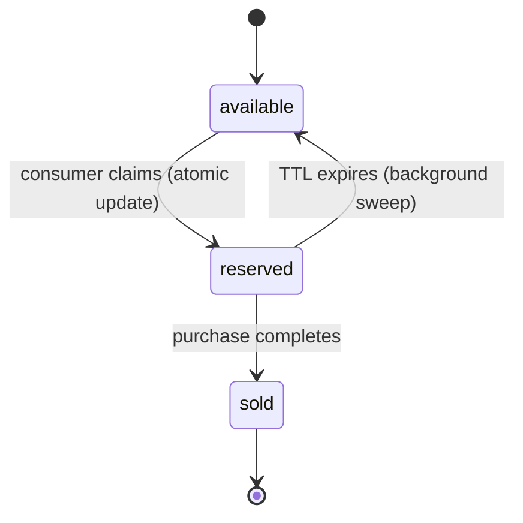

# Lottery Search System

## Deployment

Search stays read-only against bitmaps; claiming a ticket is the only path that touches Kafka and
MongoDB.



## 1. Search & Indexing Strategy

A ticket number is six digits, so there are only 1,000,000 possible numbers, 000000 through
999999. That's small enough to keep the whole space indexed in memory, and it's the thing that
shapes the rest of this design.

For each of the 6 digit positions and each of the 10 possible digits, I keep a bitmap 1,000,000
bits long, where bit `i` says whether number `i` has that digit in that position. That's 60
bitmaps total, small enough to sit in memory on every app instance, or in Redis if it
needs to be shared across them.

On top of those there's one more bitmap, same size, tracking which numbers currently have at
least one available ticket. It gets flipped incrementally whenever a ticket's status changes, so
it's always current without needing a fresh scan.

To answer something like `1****5`, I AND the availability bitmap together with the position-0='1'
bitmap and the position-5='5' bitmap:

```
result = availability_bitmap
       & position_bitmap[0]['1']
       & position_bitmap[5]['5']
```

Only the fixed positions contribute a term; wildcards just get skipped, and none of it touches
the 10-million-record ticket collection.



## 2. Concurrency: Preventing Duplicate Simultaneous Allocation

Requests get published to Kafka first, partitioned by ticket `number`, so everything for a given
number lands on the same partition and gets processed in order by one consumer. That smooths out
bursty traffic. Kafka isn't what guarantees correctness though. The actual claim happens inside
the consumer, via a single-document update in MongoDB, one candidate number at a time. Given a
request that matched numbers `[n1, n2, ...]` from section 1, the consumer goes through them one
by one: for each candidate number, it tries to update one ticket where the number matches and the
status is still available, setting the status to reserved along with who reserved it and when.
If that update actually finds and changes a matching ticket, that's the one handed back to the
request; if nothing matches anymore, because someone else already claimed it, the consumer just
moves on to the next candidate number.

A single-document update in MongoDB either fully completes or doesn't happen at all, never
something in between, so this either claims a matching ticket or finds none left for that number.
Two concurrent callers can never end up with the same instance, and neither one blocks the other.
That guarantee holds no matter how many consumers are running at once, and even for anything that
writes to the same collection outside Kafka entirely, because that guarantee comes from MongoDB
itself, not from the queue. A consumer that crashes mid-claim can just retry, since the update
either went through or it didn't.

Reservations carry a TTL, five minutes say, for the window while someone's completing a purchase.
A background sweep runs periodically, flips any reservation older than the TTL back to
available, and flips the number back on in the availability bitmap.





## 3. Storage Technology Choice

Using MongoDB. Claiming a ticket comes down to a single-document update, which MongoDB always
completes fully or not at all on its own, no explicit locking or transaction syntax needed.
Ticket data is also simple and flat (id, number, status, who reserved it,
when), and MongoDB supports proper indexes on `number` and `status` for the lookup, same as it
would in a table. It has backups and replication too.

And using Redis and Kafka too, but they're doing different jobs, not the same
one twice. Kafka smooths out *when* requests arrive, so a burst of searches for the same hot
pattern doesn't slam MongoDB all at once. Redis speeds up *how fast a claim resolves* once a
consumer picks a request up: it holds the available instance IDs for each number, so the consumer
can grab a candidate at memory speed before confirming it in MongoDB. The real data always stays
in MongoDB, since the Redis state is always rebuildable from it.

## 4. Performance Analysis

At 10 million tickets, search stays fast because it works on the small bitmap from section 1, not
the ticket collection itself, and claiming one ticket is just an indexed update, not a scan
through everything.

If data or usage grows a lot beyond this, different parts of the system scale in different ways:

- **API**: add more instances in parallel
- **Kafka**: add more partitions and consumers
- **Redis**: Redis Cluster
- **MongoDB (reads)**: add replica set members
- **MongoDB (writes)**: sharding is built in natively, splitting data into chunks and
  distributing them automatically, more straightforward here than it would be with a
  relational database
